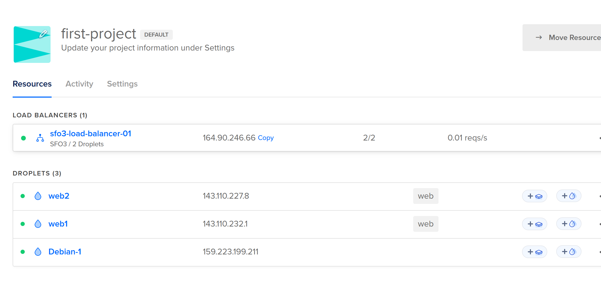

# as3p2-starter-f23

You will have to edit some of these files to get your web servers working.

The included backend server runs on port 8080, 127.0.0.1:8080

## Included material

- backend binary, hello-server
- frontend, index.html
- nginx configuration file, hello.conf
- service file for backend, hello-server.service
- config for setting up servers, cloud-config.yml
- example curl commands for testing your server, curl.md

## Where each file needs to go
- hello-server -> /var/www/backend
- hello-server.service -> /etc/systemd/system
- hello.conf -> /etc/nginx/sites-available
- index.html -> /etc/var/www/my-site
- (you need to create the my-site and backend directory first.)

Video link: https://youtu.be/arUlltOOFD0
- I don't know how to record more than 1 app at a time so I included a screenshot of digital ocean instead.

